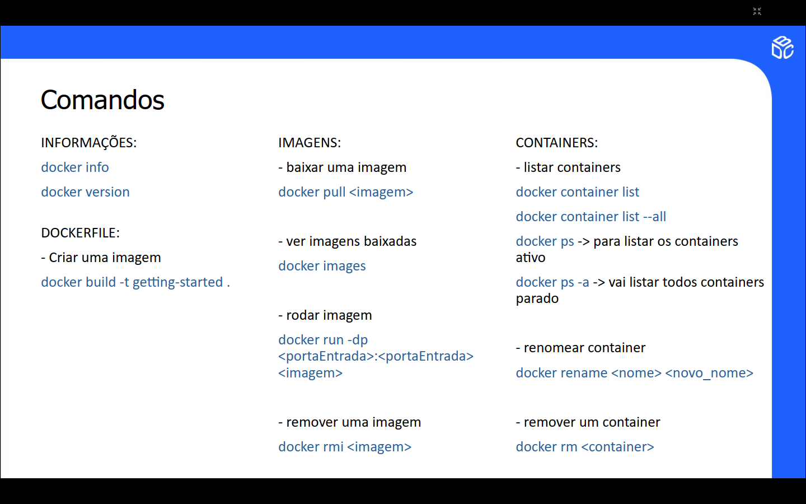

# Docker 

O [docker](https://docs.docker.com/get-started/)  é uma plataforma de virtualização leve que utiliza contêineres para empacotar e isolar aplicações e 
suas dependências. Ele permite que os aplicativos sejam executados de maneira consistente em qualquer ambiente, 
independentemente de diferenças no sistema operacional ou configuração. Os contêineres são eficientes, rápidos e 
consomem menos recursos do que máquinas virtuais. O Docker é amplamente usado para desenvolvimento, teste e 
implantação de software em ambientes escaláveis e ágeis.

[Documentação utilizada para desenvolver o conteiner intitulado de: getting-started-todo-app ](https://docs.docker.com/get-started/introduction/develop-with-containers/)

## Dockerfile

O Dockerfile é um arquivo de configuração usado para criar imagens Docker de forma automatizada. Ele contém instruções passo a passo que descrevem como construir a imagem, como definir o sistema operacional base, instalar dependências, copiar arquivos, configurar variáveis de ambiente e especificar o comando inicial a ser executado quando o contêiner for iniciado. Com ele, é possível garantir consistência no ambiente de execução e simplificar o processo de implantação de aplicações.

**OBS: O arquivo Dockerfile deverá começar obrigatoriamente com o D (maiúsculo) e está inserido na pasta raiz, conforme, container intitulado de getting-started-todo-app**

### Principais **Instruções** do Dockerfile:

**FROM** node:14

**WORKDIR** /app

**COPY** . /app

**RUN** npm install

**EXPOSE** 3000

**CMD** ["node" , "app.js"]

## Docker Compose 

O docker compose é uma ferramenta que permite definir e gerenciar aplicativos multicontêiner de forma 
declarativa. Utilizando um arquivo YAML (docker-compose.yml), você pode configurar serviços, volumes, redes e 
variáveis de ambiente para múltiplos contêineres. Ele facilita a execução simultânea de todos os serviços com 
um único comando (docker-compose up), simplificando o desenvolvimento, teste e orquestração de aplicações. 
É ideal para aplicações que dependem de vários serviços interconectados, como bancos de dados e APIs.

### Stackoverflow

[Configuração de um docker-compose de uma API Web com Mysql](https://stackoverflow.com/questions/77431124/docker-mysql-container-starts-and-then-immediately-stops-when-using-docker-compo)

## Docker Hub 

O [Docker Hub](https://hub.docker.com/) é um repositório centralizado na nuvem para armazenar, compartilhar e gerenciar imagens Docker. 
Ele fornece acesso a imagens públicas e privadas, incluindo imagens oficiais mantidas pela Docker Inc. e pela 
comunidade. Com suporte para builds automatizados, controle de acesso e integração com pipelines de CI/CD, 
o Docker Hub facilita a distribuição e colaboração em projetos baseados em contêineres. É amplamente utilizado 
para encontrar imagens prontas para uso ou como um repositório seguro para suas próprias imagens. 


## Principais comandos do Docker



Além dos comandos supracitados destacamos a seguir alguns comandos para publicação e compartilhamento de imagens no Docker Hub, apresentados no curso de Docker do Tech Up Challenge:

**Após criar e rodar a imagem no terminal através dos comandos:**

```bash
$ docker build -t meu-app-node .
```

```bash
$ docker run -p 3000:3000 meu-app-node 
```
<br>

* Fazer login no Docker Hub usando o terminal: 

```bash 
$ docker login 
```

* Marcar sua imagem com nome de usuário do Docker Hub e o nome do repositório:

```bash
$ docker tag meu-app-node seu-usuario/meu-app-node
```

* Fazer o push da imagem para o Docker Hub: 

```bash
$ docker push seu-usuario/meu-app-node
```
<br>

Para criar e executar Containers Docker inserir os seguintes comandos no terminal:

```bash
$ docker run [OPÇÕES] nome_da_imagem [COMANDO]
```
Exemplo: 
```bash
$ docker run -it ubuntu:latest /bin/bash
```

**-it** : Permite iteragir com o container usando um terminal interativo.

**ubuntu:latest** : Nome da imagem a ser usada.

**/bin/bash** : Comando a ser executado dentro do container (nesse caso, abrir um shell bash).

**Abaixo detalhamos algumas [OPÇÕES] comuns do Docker Hub:**

**-d** : Executa o container em segundo plano (modo detached)

**-p [host_port] : [container_port]** : Faz o mapeamento das portas entre o host e o container.

**--name [nome]** : Define um nome personalizado para o container.

**-v [host_path] : [container_path]** : Monta um volume entre o host e o container.

## Outros comandos importantes

* Inicia um container criado anteriormente:
```bash
docker start [nome_ou_id_do_container]
```
* Para um container em execução:

```bash
docker stop [nome_ou_id_do_container]
```
* Reinicia um container:

```bash
docker restart [nome_ou_id_do_container]
```
* Remove um container:

```bash
docker rm [nome_ou_id_do_container]
```
*  Remover os containers, redes, volumes e imagens definidas em um arquivo, ou seja, mata o docker compose.

```bash
docker compose down
```

* Monitora as atualizações dos containers,automaticamente, enquanto se faz as alterações no código ou nas configurações.
**OBS: Não é um comando padrão do Docker Compose**
```bash
docker compose watch
```
* Esse **SIM** é um comando padrão do Docker Compose, usado para reconstruir e reiniciar os containers sempre que você fizer alterações no código ou nas imagens, o que, de certa forma, simula um comportamento de "watch" manual.

```bash
docker compose up --build
```